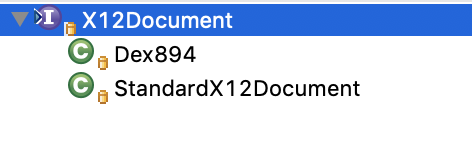

# Guidelines for contributing an EDI X12 Parser

Each new X12 Parser should be placed in its own package. 

	x12
		asn856
		po850
		dex
			dx894

## What is the format?
The first step is to create the domain model for the format. This object (or set of objects) will represent structure of the EDI X12 document and define the attributes. 

The domain model attributes should use the more readable names of the attributes instead of their segment identifiers and element id. 

For example the element ISA08 represents the interchange receiver id. It is modeled on the `InterchangeControlHeader` object as follows:

	// ISA08
	private String interchangeReceiverId;

The next step is to determine whether the format shares segments with other EDI documents. For example the ISA and GS segment lines are common (ASN 856 and PO 850).

If the format shares common segments then the domain object should probably `extend` the `AbstractStandardX12Document`. This will provide an object with all of the common segments, allowing the developer to add the elements unique to the format in the concrete class. If the format does not share any (or many) common segments then it should `implement` the `X12Document` interface. 

TODO

## Creating the Parser
If the domain object (created above) representing the document extended `AbstractStandardX12Document` then you will want to have your parser `extend` the `AbstractStandardX12Parser`. This will provide the ability to parse all of the common segments and add them to the domain model object. Otherwise the parser must `implement` the `X12Parser` interface. 

## The X12Parser
The `X12Parser` interface defines a simple method that is expected to accept a `String` representation of the document. It will parse the document and return a concrete instance of the domain model object, which must be an `X12Document`

	public interface X12Parser<T extends X12Document> {
    		T parse(String sourceData);
    	}

## The AbstractStandardX12Parser
The `AbstractStandardX12Parser` uses the template pattern to implement the `parse` method. 

